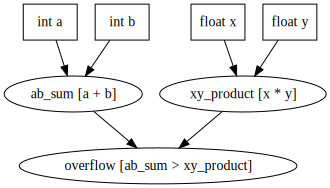

# µReact

Minimalistic C++ single-header reactive library

## Design goals

I want to have a library that allows me to make a graph of dependent values like
it is done in excel like programs and in [functional programming](https://en.wikipedia.org/wiki/Functional_programming).



As a result recalculations should be performed as soon as they needed and only for
values that are really changed without overhead on recalculation the same values
again and again. \
Also I want to be notified when some of the values has changed.
Ability to change several values atomically is needed too, because it allows not
to recalculate intermediate unneeded results. \
I want to perform all calculation related actions deterministically in the single
thread, so the library would be thread unsafe by purpose.

### The problem to solve

Let's imagine some system program that should handle a lot of flags and variables.
These variables can be separated into two groups:

* Mutable variables. They can be read from somewhere, or can be requested to change
  from everywhere.
  In excel like programs it would be cell without formula.
* Calculated variables. Their values can't be directly set, but instead they have
  some [pure function](https://en.wikipedia.org/wiki/Pure_function) that says how
  to calculate actual value from another variables (mutable or calculated).
  In excel like programs it would be cell with formula.

Note: functions that are not [pure](https://en.wikipedia.org/wiki/Pure_function)
are considered as mutable variables. Some code should read a new value and set it
to a mutable variable. Examples are time(), rand(), scanf() etc.

Let's build a simple system framework to see all my pain on compilable and runnable
example.

Straightforward way to implement a storage - is adding one big
(or several small ones) state singleton. Let's call it SystemState:
```cpp
// Singleton that contains all read and calculated values. All these values
// could be as well private for some SubSystems, separated into several singletons etc
struct SystemState
{
    int a {};
    int b {};

    int ab_sum {};
    
    static SystemState& instance() {
        static SystemState ss;
        return ss;
    }
private:
    SystemState() = default;
};
```

And let's make our little system in modular way, where we have separate subsystem
for separate tasks. System works in main loop (or in system loop, doesn't matter)
and receives update call on each iteration. System calls update for each subsystem
in general in non deterministic order (there shouldn't be the right order of updates). \
Additionally our example system supports trivial event system. In general order of
handling events shouldn't matter too.

```cpp
#include <iostream>
#include <cassert>
#include <vector>
#include <map>
#include <functional>
#include <algorithm>

class SubSystem;

// ================================
// Core object that needed to pass update call to each registered SubSystem object.
// Supports simple event model.
class System
{
public:
    friend class SubSystem;

    System() = default;

    void update( size_t index );

private:
    void registerSubSystem( SubSystem* subSystemPtr )
    {
        const auto it = std::find( m_subSystems.begin(), m_subSystems.end(), subSystemPtr );
        assert( it == m_subSystems.end() );
        m_subSystems.push_back( subSystemPtr );
    }

    void unregisterSubSystem( SubSystem* subSystemPtr )
    {
        const auto it = std::find( m_subSystems.begin(), m_subSystems.end(), subSystemPtr );
        assert( it != m_subSystems.end() );
        m_subSystems.erase( it );
    }

    void sendEvent( const std::string& type );

    std::vector<SubSystem*> m_subSystems {};
};

// ================================
// Base class for system logic. Registers self in given System in constructor
// and unregisters self in destructor.
// Supports simple event model.
class SubSystem
{
public:
    friend class System;

    explicit SubSystem( System& systemRef )
        : m_system( systemRef )
    {
        m_system.registerSubSystem( this );
    }

    ~SubSystem()
    {
        m_system.unregisterSubSystem( this );
    }

    void sendEvent( const std::string& type )
    {
        m_system.sendEvent( type );
    }

    virtual void update( size_t index ) {}

protected:
    void registerEventHandler( const std::string& type, const std::function<void()>& handler )
    {
        m_eventHadlers[type] = handler;
    }

private:
    void handleEvent( const std::string& type )
    {
        const auto it = m_eventHadlers.find( type );
        if( it != m_eventHadlers.end() )
        {
            it->second();
        }
    }

    System& m_system;
    std::map<std::string, std::function<void()>> m_eventHadlers {};
};

// Out of class methods of System. Can't be inlined because need SubSystem declaration.
void System::update( const size_t index )
{
    for( SubSystem* subSystemPtr : m_subSystems )
    {
        subSystemPtr->update( index );
    }
}

void System::sendEvent( const std::string& type )
{
    for( SubSystem* subSystemPtr : m_subSystems )
    {
        subSystemPtr->handleEvent( type );
    }
}
```

So. Finally we are ready to make our first problem example. \
Here we have two separate subsystems. One that imitates reading of two values:
'a' and 'b'. And one that calculates sum of 'a' and 'b'.

First way to do so it's just perform (TODO write end of the phrase)

```cpp
// Singleton that contains all read and calculated values. All these values
// could be as well private for some SubSystems, separated into several singletons etc
struct SystemState
{
    int a {};
    int b {};

    int ab_sum {};

    void checkInvariant() const
    {
        std::cout << "SystemState::checkInvariant()\n";

        const bool abSumCheckResult = ab_sum == (a + b);
        std::cout << "    " << (abSumCheckResult ? "[OK]" : "[FAILED]");
        std::cout << " ab_sum==(a+b) [" << ab_sum << " == (" << a << " + " << b << ")]\n";
    }

    static SystemState& instance() {
        static SystemState ss;
        return ss;
    }
private:
    SystemState() = default;
};

// SubSystem that imitates reading 'a' and 'b' values from some source
class AbReader : public SubSystem
{
public:
    explicit AbReader( System& systemRef ) : SubSystem( systemRef ) {}

    void update( const size_t index ) override
    {
        std::cout << "AbReader::update()\n";
        SystemState& ss = SystemState::instance();
        ss.a = (index + 1);
        ss.b = (index + 1) * 2;
    }
};

// AB sum calculator version that performs calculation every update
class AbSummator : public SubSystem
{
public:
    explicit AbSummator( System& systemRef ) : SubSystem( systemRef ) {}

    void update( const size_t /*index*/ ) override
    {
        std::cout << "AbSummator::update()\n";
        calculateAb();
    }

    void calculateAb()
    {
        std::cout << "AbSummator::calculateAb()\n";
        SystemState& ss = SystemState::instance();
        ss.ab_sum = ss.a + ss.b;
    }
};

int main()
{
    System system;

    // SubSystems creation. Order matters.
    AbReader abReader( system );
    AbSummator abSummator( system );

    for( size_t i = 0; i < 3; ++i )
    {
        std::cout << "=================\n";
        std::cout << i << "th update\n";
        system.update( i );
        SystemState::instance().checkInvariant();
    }
}
```

Let's [compile and run it](https://godbolt.org/z/xK3WWz). 
Our output should be:

```console
=================
0th update
AbReader::update()
AbSummator::update()
AbSummator::calculateAb()
SystemState::checkInvariant()
    [OK] ab_sum==(a+b) [3 == (1 + 2)]
=================
1th update
AbReader::update()
AbSummator::update()
AbSummator::calculateAb()
SystemState::checkInvariant()
    [OK] ab_sum==(a+b) [6 == (2 + 4)]
=================
2th update
AbReader::update()
AbSummator::update()
AbSummator::calculateAb()
SystemState::checkInvariant()
    [OK] ab_sum==(a+b) [9 == (3 + 6)]
```

As we can see, all works perfectly fine. \
But let's change subsystem's order and [check the result](https://godbolt.org/z/35Yvz4).

```cpp
    // SubSystems creation. Order matters.
    AbSummator abSummator( system );
    AbReader abReader( system );
```

As we can see now our sum is outdated each iteration.

```console
=================
0th update
AbSummator::update()
AbSummator::calculateAb()
AbReader::update()
SystemState::checkInvariant()
    [FAILED] ab_sum==(a+b) [0 == (1 + 2)]
=================
1th update
AbSummator::update()
AbSummator::calculateAb()
AbReader::update()
SystemState::checkInvariant()
    [FAILED] ab_sum==(a+b) [3 == (2 + 4)]
=================
2th update
AbSummator::update()
AbSummator::calculateAb()
AbReader::update()
SystemState::checkInvariant()
    [FAILED] ab_sum==(a+b) [6 == (3 + 6)]
```

TODO examples for each way to calculate a value:

* Calculate every update (even if vars are changed very rarely)
* Calculate on demand (and if value is demanded tens times per update)
* Calculate if variable change is detected
* Calculate if variable change is notified (recalculated N times as much
  variable changes are notified)
* Calculate if variable group change is notified

TODO: make all of examples as complete code.

## Copyright notice

The project has started as some kind of global redesign of the
[cpp.react](https://github.com/schlangster/cpp.react) that was created by
Sebastian Jeckel. All of the code is derivative work of the initial project.
So if you see some classes or architecture solutions then it's most likely they
were taken directly from the origin with some little tweaks.

For convenience reasons I removed copyright notice from the headers because the
header structure is subject to change and it's easier to change if I don't have
to include boilerplate text to every single header.

Original copyright notice: 
```
//          Copyright Sebastian Jeckel 2014.
// Distributed under the Boost Software License, Version 1.0.
//    (See accompanying file LICENSE_1_0.txt or copy at
//          http://www.boost.org/LICENSE_1_0.txt)
```

The code structure is also subject to change, so I don't mark any code as taken
from Sebastian Jeckel's cpp.react. I'll do it if I have to, but only for the
release version
when the code won't be altered so often.

Even in the final version, I expect that 80-90% of the code would be from the
initial project, so it's easier to say it in the readme and call it a day.
Because all the code will be overwhelmed with copyright notices otherwise.
