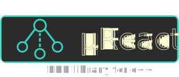

# µReact

<p align="center"></p>

[](https://en.wikipedia.org/wiki/C%2B%2B#Standardization)
[](https://github.com/ureact/workflows/actions?query=workflow%linux)
[](https://github.com/ureact/workflows/actions?query=workflow%windows)
[](https://github.com/ureact/workflows/actions?query=workflow%macos)
[](https://github.com/YarikTH/ureact/actions/workflows/codeql-analysis.yml)
[](https://www.codacy.com/gh/YarikTH/ureact/dashboard?utm_source=github.com&amp;utm_medium=referral&amp;utm_content=YarikTH/ureact&amp;utm_campaign=Badge_Grade)
[](https://lgtm.com/projects/g/YarikTH/ureact/context:cpp)
[](https://raw.githubusercontent.com/YarikTH/ureact/main/LICENSE.MIT)
[](https://github.com/YarikTH/ureact/releases)
[](https://github.com/YarikTH/ureact/releases)
[](https://github.com/YarikTH/ureact/issues)
[](.) 

Minimalistic C++ single-header reactive library

## Copyright notice

The project has started as some kind of global redesign of the
[cpp.react](https://github.com/schlangster/cpp.react) that was created by
Sebastian Jeckel. All of the code is derivative work of the initial project.
So if you see some classes or architecture solutions then it's most likely they
were taken directly from the origin with some little tweaks.

For convenience reasons I removed copyright notice from the headers because the
header structure is subject to change and it's easier to change if I don't have
to include boilerplate text to every single header.

Original copyright notice: 
```
//          Copyright Sebastian Jeckel 2014.
// Distributed under the Boost Software License, Version 1.0.
//    (See accompanying file LICENSE_1_0.txt or copy at
//          http://www.boost.org/LICENSE_1_0.txt)
```

The code structure is also subject to change, so I don't mark any code as taken
from Sebastian Jeckel's cpp.react. I'll do it if I have to, but only for the
release version
when the code won't be altered so often.

Even in the final version, I expect that 80-90% of the code would be from the
initial project, so it's easier to say it in the readme and call it a day.
Because all the code will be overwhelmed with copyright notices otherwise.
