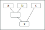
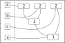
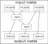

= Dataflow model
:toc:
:author: Sebastian Jeckel

NOTE: The following is an adapted version of the articles
https://snakster.github.io/cpp.react/guides/Dataflow-model.html[Dataflow model],
https://snakster.github.io/cpp.react/guides/engines/[Propagation engines] and
https://snakster.github.io/cpp.react/guides/engines/Toposort-engine.html[Toposort engine]
from the https://snakster.github.io/cpp.react/[cpp.react]'s documentation.

== Graph model

The dataflow between reactive values can be modelled (and visualized) as a https://en.wikipedia.org/wiki/Directed_acyclic_graph[directed acyclic graph (DAG)].
Such a graph can be constructed from the dependency relations; each entity is a node and directed edges denote data propagation paths.

To give an example, let `a`, `b` and `c` be arbitrary signals.
`x` is another signal that is calculated based on the former.

.Graph model example
[source,c++]
----
context ctx;
var_signal a = make_var(ctx, ...);
var_signal b = make_var(ctx, ...);
var_signal c = make_var(ctx, ...);
signal x = (a + b) + c;
----

This is the matching dataflow graph:

From a dataflow perspective, what kind of data is propagated and what exactly happens to it in each node is not relevant.

`µReact` does not expose the graph data structures directly to the user; instead, they are wrapped by lightweight proxies.
Such a proxy is essentially a shared pointer to the heap-allocated node.
Examples of proxy types are `events`, `signal` and `observer`.
The concrete type of the node is hidden behind the proxy.

We show this scheme for the previous example.
The `make_var` function allocates the respective node and links it to the returned proxy.
Not all nodes in the graph are bound to a proxy; the temporary sub-expression `a + b` results in a node as well.
If a new node is created, it takes shared ownership of its dependencies, because it needs them to calculate its own value.
This prevents the `a + b` node from disappearing.

The resulting reference graph is similar to the dataflow graph, but with reverse edges (and as such, a DAG as well):

The number inside each node denotes its reference count.
On the left are the proxy instances exposed by the API.
Assuming the proxies for `a`, `b` and `c` would go out of scope, but `x` remains, the reference count of all nodes is still 1 until `x` disappears as well.
Once that happens, the graph is deconstructed from the bottom up.

=== Input and output nodes

From now on, we refer to the set of interconnected reactive values as a reactive system.
A closed, self-contained reactive system would ultimately be useless, as there's no way to get information in or out.
In other words, mechanisms are required to:

* react to external input
* propagate side effects to the outside

The outside refers to the larger context of the program the reactive system is part of.

To address the first requirement, there exist designated *input nodes* at the root of the graph.
They are the input interface of the reactive system and can be manipulated imperatively.
This allows the integration of a reactive system with an imperative program.

Propagating changes to the outside world could happen at any place through side effects since C++ does not provide any means to enforce functional purity.
However, since side effects have certain implications on our ability to reason about program behaviour, by convention they're moved to designated *output nodes*.
By definition, these nodes don't have any successors.
Analogously to *input nodes*, they are the output interface of the reactive system.

A typical example of an input node proxy is a `var_signal`, while an example of an output node proxy is an `observer`.

This is the explanatory dataflow graph to show the difference:

Additionally, `signal` has imperative *output* side channel — `signal::get()` method and its analogs.

=== Proxy reassignment

Important consequence of user-faced proxy having shared pointer semantics is the fact that reassignment of `signal`, `var_signal` etc results creation of a new node instead of modifying existing one.

Let's modify graph model example:

[source,c++]
----
context ctx;
var_signal a = make_var(ctx, ...);
var_signal b = make_var(ctx, ...);
var_signal c = make_var(ctx, ...);
signal x = (a + b) + c;
a = make_var(ctx, ...);
----

We can see what happened in the modified graph:

image::media/dataflow_reference_graph_reassignment.svg[dataflow_reference_graph_reassignment]

.Consequences:
1. `a` is reassigned to a new node that and has no relation to the old one.
2. We can't longer modify old `a` node, because we have lost all `var_signal` objects pointing to it, so it is effectively become a constant.
3. Dependency graph of `x` is intact.
It depends on the old `a` node as before and it keeps this node alive.

This is counterintuitive, but very important to understand.

If we really need to reassign new signals and events the way, all dependent nodes will see the change — dynamic nodes are required.

=== Static and dynamic nodes

So far, the dependency relations between reactive values were static, because they were established declaratively and could not be changed afterwards.
There exists another type of node, so-called dynamic nodes, where this is not the case.
The characteristic of dynamic nodes is that they can change their predecessors as a result of being updated.
This has no further implications on any propagation properties, other than complicating the implementation.

Example of dynamic node is `flatten`.

=== Contexts

Organizing all reactive values in a single graph would become increasingly difficult to manage.
For this reason, µReact allows multiple graphs in the form of ``context``s.
Each context is independent and groups related reactive nodes.
The implementation uses runtime binding to the context at the reactive value construction type.

[CAUTION]
====
Interaction of nodes from different contexts is forbidden. +
Interaction with each context should be performed from a single thread only.
====

`context` is explicitly passed only in input node factory functions `make_MEOW`.
All other nodes depend on some existing nodes, so `context` of source nodes is copied on construction.
For example in "Graph model example" `a`, `b` and `c` receive `context` explicitly via `make_var` function argument, while `(a + b)` and `x` copy `context` from `a`, `b` and `c` on which they are depend on.

Similar to hidden graph data structures, `context` is a lightweight proxy itself.
`context` is essentially a shared pointer to the heap-allocated reactive graph.

Let's add `ctx` and react graph on the previous reference count graph:

Hidden react graph and arrows from its owners are red.

Each hidden node has the copy of `context`.
Hidden react graph is owned both by the user owned ``context``s (`ctx` in our example) and indirectly by the proxy values like `events`, `signal` and `observer`.

=== Cycles

For static nodes, all dependencies have to be passed upon initialization; this makes it impossible to construct cycles.
Dynamic nodes, on the other hand, can change their dependencies after initialization.
This means they can be attached to one of their predecessors.

Creating cyclic graphs any way is not permitted and results in undefined behaviour.

== Propagation model

The process of data flowing through the graph can be summarized as follows:

1. The graph is an idle state, ready to accept imperative input through its input nodes.
2. Input arrives.
3. The targeted input nodes evaluate their input and decide, whether they have been changed.
If they have been changed, they notify their successors.
4. Notified successors to update themselves based on the current values of their predecessors.
If they have been changed, they further notify their own successors, and so on.
5. After the changed portion of the graph has been updated, the graph returns to its idle state.

This process of updating the graph as a result of input is called a *(propagation) turn*.
An example is shown in the following figure:

Here, the updated portion of the graph has been marked.
It should be noted that not necessary the whole subset of reachable nodes from the input will be updated.

=== Transactions

Input consists of a single value, targeted at a specific input node.
The propagation model that has been described above is not limited to processing a single input per turn.
To account for that, a *transaction* is defined as a sequence of inputs.
For a consistent model, we define that all inputs result in transactions, even if they only contain a single element.

=== Properties

A turn can be represented as a sequence of node updates, each with a result (changed, unchanged).
There are several guaranteed properties for such update sequences:

Consistency:: After a node has been changed, its successors will be updated.
Update minimality:: A node is only updated if it has at least one changed predecessor.
A node is only updated once per turn.
Glitch freedom:: A node is only updated after all its predecessors, which would be updated in the same turn, are done.

Consistency describes the nature of change propagation, which must leave the whole graph in a consistent state afterwards.

== Propagation engine

The update propagation strategy is implemented by a propagation engine.

Unlike its ancestor https://github.com/schlangster/cpp.react[cpp.react], `µReact` has inherited single propagation engine — sequential version of Toposort Engine.

=== Toposort engine

==== Motivation

Topological sorting of the graph nodes to decide on the update order is a common strategy among reactive programming implementations.
It can guarantee glitch freedom and update minimality.

==== Concept

To apply the topological sorting, each node is assigned a level, which is the maximum level of its predecessors plus 1. Nodes without any predecessors are at level 0.

This figure shows how the update propagation proceeds in level iterations after a node has been changed:

==== Algorithm

Toposort executes updates in the same thread that triggered the input.
It can be implemented with a priority queue that's ordered by node level, but to reduce the number of swaps, an improved algorithm is used:

....
Q = Successors of changed input nodes

While Q is not empty:
  P = {}
  Find minimum level m in Q
  Move nodes with level m from Q to P
  Update nodes in P
  Add successors of changed nodes to Q
....

`Q` contains all nodes that are scheduled to be updated eventually. `P` contains all nodes with the same level that are to be updated next.
Selecting and moving nodes from `Q` to `P` can be done efficiently by partitioning `Q`, which only has to be done once per iteration.
