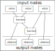

# Dataflow model

Disclaimer: based on [Dataflow model guide from cpp.react](http://snakster.github.io/cpp.react/guides/Dataflow-model.html)

* [Graph model](#graph-model)
  * [Input and output nodes](#input-and-output-nodes)
  * [Static and dynamic nodes](#static-and-dynamic-nodes)
  * [Contexts](#contexts)
  * [Cycles](#cycles)
* [Propagation model](#propagation-model)
  * [Transactions](#transactions)
  * [Properties](#properties)
* [Conclusions](#conclusions)

## Graph model

The dataflow between reactive values can be modelled (and visualized) as a [directed acyclic graph (DAG)](https://en.wikipedia.org/wiki/Directed_acyclic_graph).
Such a graph can be constructed from the dependency relations; each entity is a node and directed edges denote data propagation paths.

To give an example, let `a`, `b` and `c` be arbitrary signals.
`x` is another signal that is calculated based on the former.
Instead of invoking `make_function` explicitly, the overloaded `+` operator is used to achieve the same result.

```cpp
ureact::function<S> x = (a + b) + c;
```

This is the matching dataflow graph:

<p align="left"></p>

From a dataflow perspective, what kind of data is propagated and what exactly happens to it in each node is not relevant.

µReact does not expose the graph data structures directly to the user; instead, they are wrapped by lightweight proxies.
Such a proxy is essentially a shared pointer to the heap-allocated node.
Examples of proxy types are `value`, `function` and `observer`.
The concrete type of the node is hidden behind the proxy.

We show this scheme for the previous example:

```cpp
ureact::value<S> a = make_value(...);
ureact::value<S> b = make_value(...);
ureact::value<S> c = make_value(...);
ureact::function<S> x = (a + b) + c;
```

The `make_value` function allocates the respective node and links it to the returned proxy.
Not all nodes in the graph are bound to a proxy; the temporary sub-expression `a + b` results in a node as well.
If a new node is created, it takes shared ownership of its dependencies, because it needs them to calculate its own value.
This prevents the `a + b` node from disappearing.

The resulting reference graph is similar to the dataflow graph, but with reverse edges (and as such, a DAG as well):

<p align="left"></p>

The number inside each node denotes its reference count. On the left are the proxy instances exposed by the API.
Assuming the proxies for `a`, `b` and `c` would go out of scope, but `x` remains, the reference count of all nodes is still 1 until `x` disappears as well.
Once that happens, the graph is deconstructed from the bottom up.


### Input and output nodes

From now on, we refer to the set of inter-connected reactive values as a reactive system.
A closed, self-contained reactive system would ultimately be useless, as there's no way to get information in or out.
In other words, mechanisms are required to:

* react to external input
* propagate side effects to the outside

The outside refers to the larger context of the program the reactive system is part of.

To address the first requirement, there exist designated *input nodes* at the root of the graph.
They are the input interface of the reactive system and can be manipulated imperatively.
This allows the integration of a reactive system with an imperative program.

Propagating changes to the outside world could happen at any place through side effects since C++ does not provide any means to enforce functional purity.
However, since side effects have certain implications on our ability to reason about program behaviour, by convention they're moved to designated *output nodes*.
By definition, these nodes don't have any successors. Analogously to input nodes, they are the output interface of the reactive system.

A typical example of an input node is a `value`, while an example of an output node is an `observer`.

This is the explanatory dataflow graph to show the difference:

<p align="left"></p>


### Static and dynamic nodes

So far, the dependency relations between reactive values were static, because they were established declaratively and could not be changed afterwards.
There exists another type of node, so-called dynamic nodes, where this is not the case.
The characteristic of dynamic nodes is that they can change their predecessors as a result of being updated.
This has no further implications on any propagation properties, other than complicating the implementation.


### Contexts

Organizing all reactive values in a single graph would become increasingly difficult to manage.
For this reason, µReact allows multiple graphs in the form of `context`s.
Each context is independent and groups related reactive nodes.
The implementation uses runtime binding to the context at the reactive value construction type.
Interaction of values from different contexts is forbidden.
Interaction with each context should be performed from a single thread only.


### Cycles

For static nodes, all dependencies have to be passed upon initialization; this makes it impossible to construct cycles.
Dynamic nodes, on the other hand, can change their dependencies after initialization.
This means they can be attached to one of their predecessors.

Additionally, side effects from functors passed to the functions such as `value::modify()`, `make_function()` and `observe()`
might interact with the reactive system and thus form a shadow connection that is not managed by the µReact.
Currently, forming such connections is considered an undefined behaviour and should be avoided.

Creating cyclic graphs any way is not permitted and results in undefined behaviour.


## Propagation model

The process of data flowing through the graph can be summarized as follows:

1. The graph is an idle state, ready to accept imperative input through its input nodes.
2. Input arrives.
3. The targeted input nodes evaluate their input and decide, whether they have been changed. If they have been changed, they notify their successors.
4. Notified successors to update themselves based on the current values of their predecessors. If they have been changed, they further notify their own successors, and so on.
5. After the changed portion of the graph has been updated, the graph returns to its idle state.

This process of updating the graph as a result of input is called a *(propagation) turn*.
An example is shown in the following figure:

TODO: port propagation image

Here, the updated portion of the graph has been marked. It should be noted that not necessary the whole subset of reachable nodes from the input will be updated.


### Transactions

Input consists of a single value, targeted at a specific input node.
The propagation model that has been described above is not limited to processing a single input per turn.
To account for that, a *transaction* is defined as a sequence of inputs.
For a consistent model, we define that all inputs result in transactions, even if they only contain a single element.

TODO: add graphical example of calculations amount with and without transactions


### Properties

A turn can be represented as a sequence of node updates, each with a result (changed, unchanged).
There are several guaranteed properties for such update sequences:

- *Consistency*: After a node has been changed, its successors will be updated.
- *Update minimality*: A node is only updated if it has at least one changed predecessor. A node is only updated once per turn.
- *Glitch freedom*: A node is only updated after all its predecessors, which would be updated in the same turn, are done.

Consistency describes the nature of change propagation, which must leave the whole graph in a consistent state afterwards.


## Conclusions

The presented dataflow model can be summarized as follows:

* Dependency relations between reactive values are formulated declaratively and structured as a DAG.
* Dataflow is handled implicitly and provides certain guarantees with reference to order.

From this perspective, the semantics of the concrete reactive types are irrelevant, as signals and observers are all mapped onto the same graph.

Transactions are used to group inputs together, and the relationship between inputs.

Even though the graph data structures (nodes, connections) are not directly exposed, but rather implicitly represented, the underlying concepts should be understood;
they provide a visual approach to designing the dataflow model, which is a task that remains in the hands of the programmer.


---------------

[Home](readme.md#reference)
